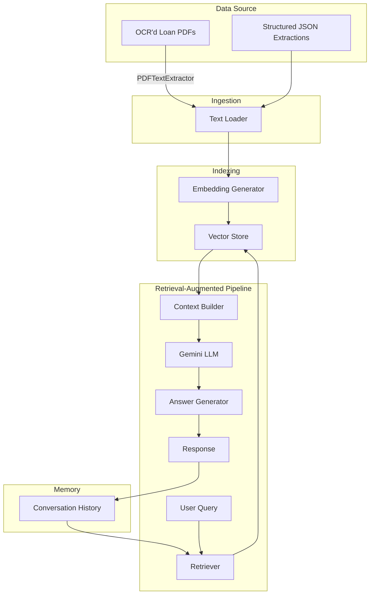

# LoanDataRAGAgent Implementation Plan

## architecture_diagram

## module_spec_table

| Module | Key Functions / Classes | Inputs | Outputs | Description |
|-------|------------------------|-------|---------|-------------|
| `data_ingestion` | `OCRLoader`, `JSONLoader` | Paths to OCR PDF files or JSON extractions | Raw text per document | Handles reading of existing OCR outputs or structured JSON to feed into indexing pipeline. Leverages [`PDFTextExtractor`](debt_extraction/loan_extraction_workflow/pdf_reader.py) for PDF text extraction. |
| `indexing` | `EmbeddingGenerator`, `VectorIndexer` | Document text | Vector embeddings stored in FAISS or similar | Generates embeddings (e.g., via Gemini embeddings API or sentence-transformers) and builds vector index. |
| `retrieval` | `LoanRetriever` | Query string, conversation history | Ranked document snippets | Performs similarity search and optional metadata filtering. |
| `rag_agent` | `LoanDataRAGAgent` | User query | Natural-language answer with citations | Orchestrates retrieval + LLM generation. Uses [`GeminiLoanExtractor`](debt_extraction/loan_extraction_workflow/gemini_loan_extractor.py) as reference for interacting with Gemini. |
| `memory` | `ConversationMemory` | Previous Q&A pairs | Context for next query | Maintains lightweight conversation state, stored in cache or database. |
| `orchestration` | `AgentRunner` | Query events | Final response, logs | Coordinates tool calling, retrieval, LLM prompts, and logging. |
| `api` | REST endpoints or CLI interfaces | HTTP/CLI requests | JSON responses | Exposes question-answering capabilities to end users. |

## timeline_table

| Phase | Duration | Milestones & Deliverables |
|------|---------|---------------------------|
| Phase 1 – Setup & Requirements | Week 1 | Gather sample OCR outputs, finalize tech stack, set up development environment. |
| Phase 2 – Data Ingestion & Indexing | Weeks 2-3 | Implement `data_ingestion` and `indexing` modules; verify embeddings; build initial vector store from processed loan documents. |
| Phase 3 – Retrieval & Agent Core | Weeks 4-5 | Develop `LoanRetriever` and `LoanDataRAGAgent`; integrate Gemini API for generation; implement conversation memory. |
| Phase 4 – Validation & Testing | Weeks 6-7 | Unit tests for each module, end‑to‑end tests using sample bundles; performance profiling. |
| Phase 5 – Deployment Prep | Week 8 | Containerize application, set up environment variables for API keys, finalize security review. |

## risk_register

| Risk | Impact | Mitigation |
|-----|-------|-----------|
| Exposure of sensitive financial data | High | Follow repo guidelines to never commit real loan documents. Use environment variables for credentials. Enforce access controls and encryption. |
| Inaccurate or non-compliant answers | High | Implement validation steps using extracted field provenance. Provide citations and confidence scores. Maintain audit logs. |
| Vector store or embedding leakage | Medium | Encrypt storage volumes, restrict network access, rotate API keys. |
| Dependency vulnerabilities | Medium | Use `check_and_install_requirements.py` to verify packages and keep them updated. Employ regular security scans. |
| API quota limits or service outages | Medium | Implement retry logic and fallback models (as suggested in the workflow plan). |
| Model hallucinations | Medium | Constrain prompts, limit generation temperature, and include retrieved context only. |

